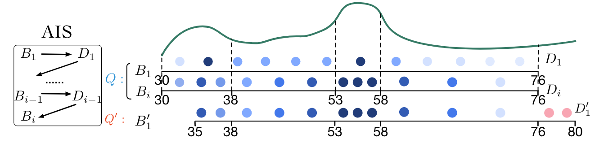

# FACE: A Normalizing Flow based Cardinality Estimator

Jiayi Wang, Chengliang Chai, Jiabin Liu, Guoliang Li

VLDB 2022

Note: The authors are from THU

---

## Guidelines

* Problem Setting & Background
* Introducing Normalizing Flow
* How to Associate NF with CE
* Experiments & Discussion

---

## Problem Setting

* Relation $T$ with $N$ tuples and $m$ attributes: $\lbrace A_1, A_2, \cdots , A_m \rbrace$. 
* Each tuple $t \in T$ is $t = (a_1, a_2, \cdots, a_m)$.
* $\theta$ is the predicate of the query, $\theta(t) = 1$ if the $t$ satisfies the query, otherwise $\theta(t) = 0$
* $\mathrm{Car}(\theta) = \sum_{t \in T} \theta(t)$
* $\mathrm{Sel}(\theta) = \mathrm{Car}(\theta) / N$

----

## On Second Thought...

* We can consider *Cardinality* and *Selectivity* equivalent.
* Predicate $\theta$ can be viewed as deciding a domain $D_\theta$ such that the calculation of $\mathrm{Sel}(\theta)$ is some kind of integration over the domain:
$$
\mathrm{Sel}(\theta) = \int_{x \in D_\theta} \rho(x) dx
$$
* We can accomplish such task if we can find a good representation of the joint distribution $\rho(x)$

---

## The alternative task

For $m$ observations $\lbrace x^j \rbrace$, estimate the probability density $\rho(x)$

----

## Maximum likelihood

The common idea to find $\rho(x)$ that maximizes the likelihood:

$$
\mathop{\operatorname{argmax}}\limits_{\rho} \prod_{j = 1}^{m} \mathbb P\lbrace X = x^j | \rho \rbrace = \mathop{\operatorname{argmax}}\limits_{\rho}\prod_{j = 1}^m \rho(x^j)
$$

We can write the functional as:

$$
L[\rho] = \frac{1}{m} \sum_{j = 1}^{m} \log \rho(x^j)
$$

Note: And our goal is to maximize such functional.

----
## One Step forward

The form of $L[\rho]$ does not provide any convenience.

To begin with, we can think of the case of calculating the arc length of a circle.

----
## The Jacobian magic

* A mapping $y = \phi(x)$ maps $x$ to a predefined distribution with PDF $p(y)$
* The PDF of $x$ becomes: 
$$\rho(x) = p(\phi(x)) \cdot |J_\phi(x)|$$
* Where $J_{\phi}(x)$ is the Jacobian: $J_\phi(x) = \det\left( \frac{\partial \phi}{\partial x} \right)$
* We have: 
$$\log \rho(x) = \log p(\phi(x)) + \log |J_\phi(x)|$$

----

## A proper $\phi$

* Previous discussion demands 2 aspects of a proper $\phi$
  * Can fit arbitrarily complicate function
  * Invertible
* Seems like you need some NN power?

----
## Introducing Flow

* Assume that we have $l$ layers, $\phi$ can be viewed as:
$$
\phi = \phi_l \circ \phi_{l - 1} \circ \cdots \circ \phi_1
$$
* Thus, we have:
$$
\log \rho(x) = \log p(\phi(x)) + \sum_{i = 1}^{l}\log |J_{\phi_i}(x_i)|
$$
* This is our new maximization objective.

----
## A working example of $\phi_i$

* Forward:  $y = (g(x_h , NN(x_l)); x_l)$
* Backward:  $y = (g^{-1}(y_h , NN(y_l)); y_l)$

----

## A working example of $\phi_i$

* Jacobian:
$$
\det \frac{\partial y}{\partial x} = 
\left |
\begin{matrix}
    \frac{\partial y_h}{\partial x_h} & \frac{\partial y_h}{\partial x_l}\\\\
    \frac{\partial y_l}{\partial x_h} & \frac{\partial y_l}{\partial x_l}
\end{matrix}
\right | = 
\left |
\begin{matrix}
    \frac{\partial g}{\partial x_h} & \frac{\partial y_h}{\partial x_l}\\\\
    O & I
\end{matrix}
\right | = 
J_g(x_h)
$$
* When $g$ is addition, $J_g \equiv 1$
* Thus the maximization objective is simply 
$$\log p(\phi(x))$$

---
## Apply NF to CE

Two major problems:
* How to encode typical data samples (categorical, string, etc.) into continuous space
* How to calculate the integration
$$
\int_{D_\theta} \rho(x) dx
$$

---
## Data encoding

Note: For every attribute, it is first treated as discrete values. Then, generate noise accordingly. The query is now range query.

----
## Dequantization

Note: p(x) is the learned PDF, q(x) is the dequantization PDF. Using cubic spline, thus the inverse is easy to compute. When adding noise, sampling on CDF, then use the inverse to map back to x. Motivation: the learned PDF is continuous, then CDF should be differentiable continuous.

---
## Monte Carlo Integration

* To compute integration $I = \int f(x)dx$, simply using Riemann Sum $\sum_i f(x_i)\Delta x$ is too slow to converge.
* We can adopt sampling based method. We draw samples from a distribution with PDF $p(x)$, and feed into $g(x)$ hoping that $\bar g(x)$ is an unbiased estimation of $I$

----
## Monte Carlo Integration (Cont.)

* Thus we have:
$$
\mathbb E \left[ \frac{1}{n} \sum_{i = 1}^{n}g(x_i) \right] = \int g(x)p(x)dx = \int f(x) dx
$$
* Which suggests that:$g(x) = \frac{f(x)}{p(x)}$
* The Monte Carlo estimator is: $F_n = \frac{1}{n} \sum_{i = 1}^{n}\frac{f(x_i)}{p(x_i)}$

----
## Adaptive Importance Sampling

* Motivation: $p(x)$ should as "similar" to $f(x)$ as possible. It will significantly reduces variance and speed up convergence.

----
## Reuse Binning Configuration

* AIS is very time-costly to compute
* We can share binning configuration between "similar" queries:
$$
\mathrm{Sim}(\theta_1, \theta_2) = \frac{|D_{\theta_1} \cap D_{\theta_2}|}{|D_{\theta_1} \cup D_{\theta_2}|}
$$

---
## Datasets

Note: Dom = domain size (#DMV), Joint = The number of entries in the entire joint distribution.

----

## Overall Evaluations

----

## Synthetic Dataset Evaluation

---
# Thank you for Listening!

Changkai MAI 

2024-07-05