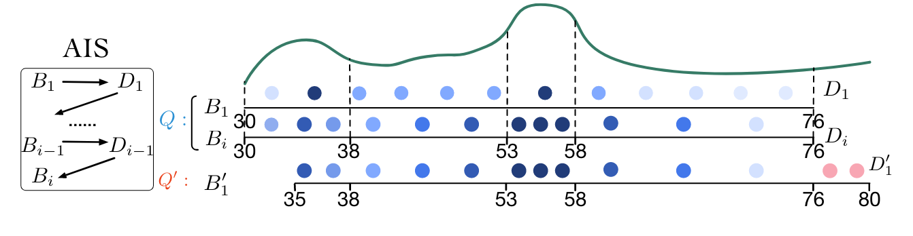
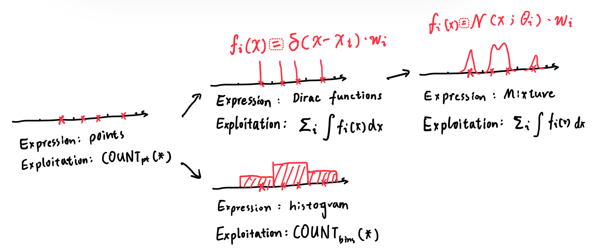
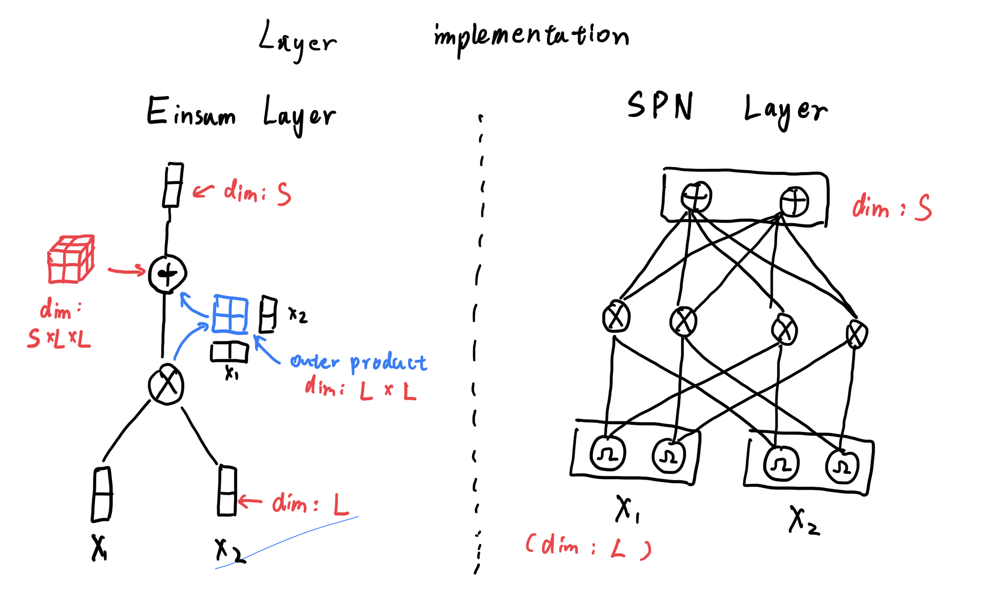

## Einsum Networks: Fast and Scalable Learning of Tractable Probabilistic Circuits

Peharz et al.

ICML 2020

---

## Guidelines

* Introduction & Background
* Trainable PC & Einsum Network
* Experiments

---

## Intro

The good'o CE again...
* Relation $T$ with $N$ tuples and $m$ attributes: $\lbrace A_1, A_2, \cdots , A_m \rbrace$. 
* Each tuple $t \in T$ is $t = (a_1, a_2, \cdots, a_m)$.
* $\theta$ is the predicate of the query, $\theta(t) = 1$ if the $t$ satisfies the query, otherwise $\theta(t) = 0$
* $\mathrm{Car}(\theta) = \sum_{t \in T} \theta(t)$
* $\mathrm{Sel}(\theta) = \mathrm{Car}(\theta) / N$

----
## Problems

* How can we properly express the dataset?
* How can we exploit the expression?

----

## Histogram

* Expression: $H_i \sim A_i, P(X) = \prod_{i} H_i(x_i)$
* Exploitation: direct integration

----

## DeepDB

* Expression: Relational SPN
* Exploitation: direct integration

----

## FLAT

* Expression: Factorized Split SPN
* Exploitation: direct integration

----

## Naru

* Expression: Auto-regressive model
* Exploitation: progressive sampling

----

## FACE

* Expression: Normalizing Flow
* Exploitation: Adaptive Importance Sampling

    
    

---

## Dilemma?

Tractable VS. Expressive

    Mixture is good, make it deep!

----

## Borrowing the ideas from Histogram

----

## Naive mixture model

* $\mathbf N_i = \lbrace \mathcal N(X_i;\theta_j)| 0 < j < l_i \rbrace$ : a set of distributions of variable $X_i$
* $P(\mathbf X) = \sum_{\mathcal N_k \in \prod_i \mathbf{N}_i} w_k\mathcal{N}_k(\mathbf X)$ : a Gaussian Mixture

> While it takes $O(l^n)$ time to infer / train, it is very inefficient.

----

## Build such mixture from scratch

----

## Constraints

* Smoothness: children of Sum node have same scope
* Decomposability: children of Product node have non-overlapping scope

----

## RAT-SPN

---

## Einsum Network

Using Einsum layer to provide a unified interface as NN, thus can be empowered by GPU:

----

## Numeric Stability

The computation of Einsum is denoted as:
$$S_k = \mathbf W_{kij} N_iN_j$$

----
## The "log-sum-exp" trick

Rewrite the equation:

$$\log S_k = \log \sum_{i, j} W_{kij}\exp(\log  N_i)\exp(\log N_j)$$

Let $a = \max_i \log N_i$, $a' = \max_j \log N_j$, we have:

$$\log S_k = a + a' + \log \sum_{i, j} W_{kij}\exp(\log  N_i - a)\exp(\log N_j - a')$$

---

### Experiment#1-Correctness

----

### Experiment#2-Efficiency

----

### Experiment#3-Capability

---

# Thank you for Listening!

Changkai MAI 

2024-11-08